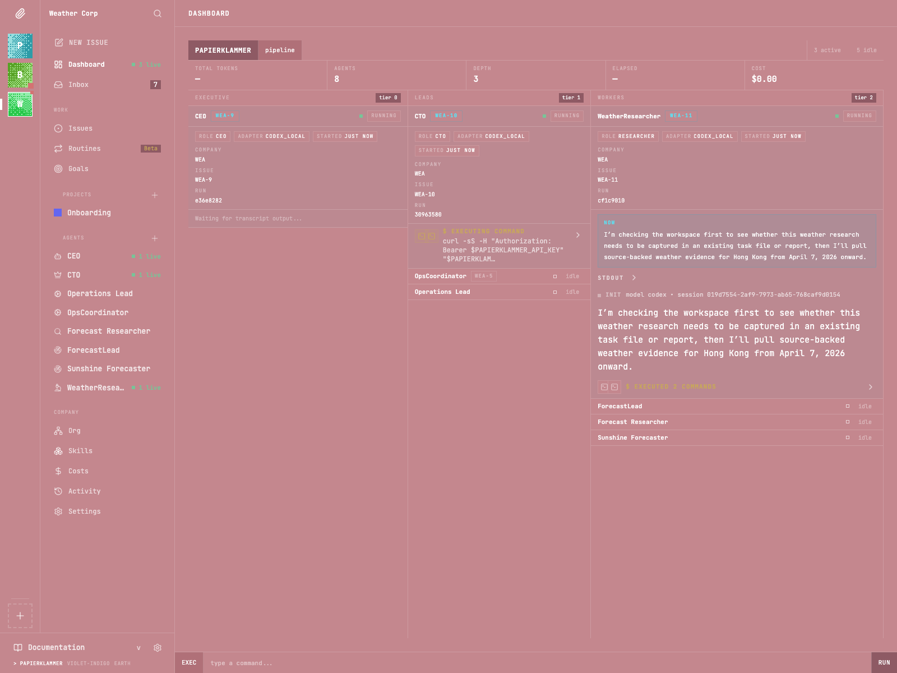
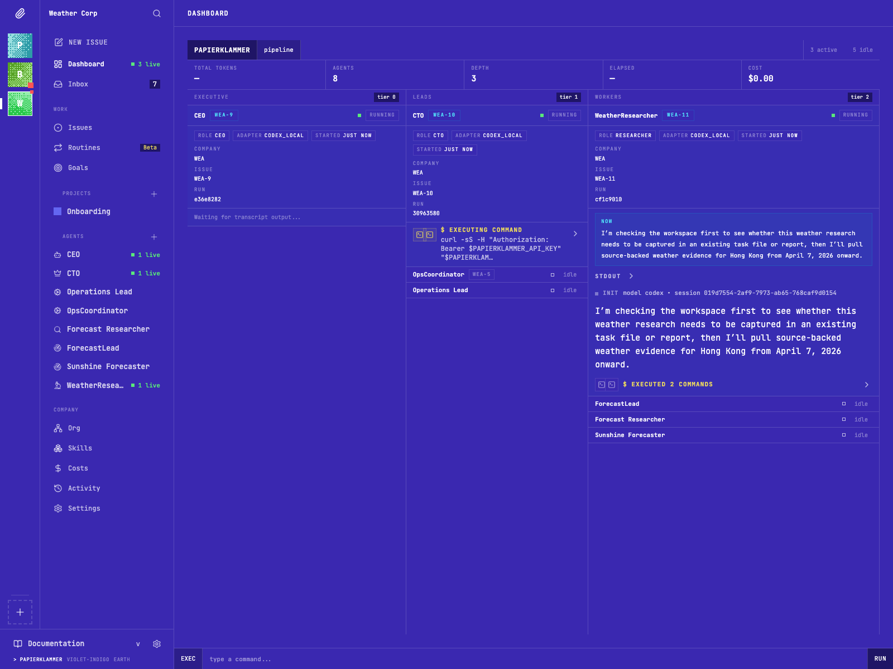
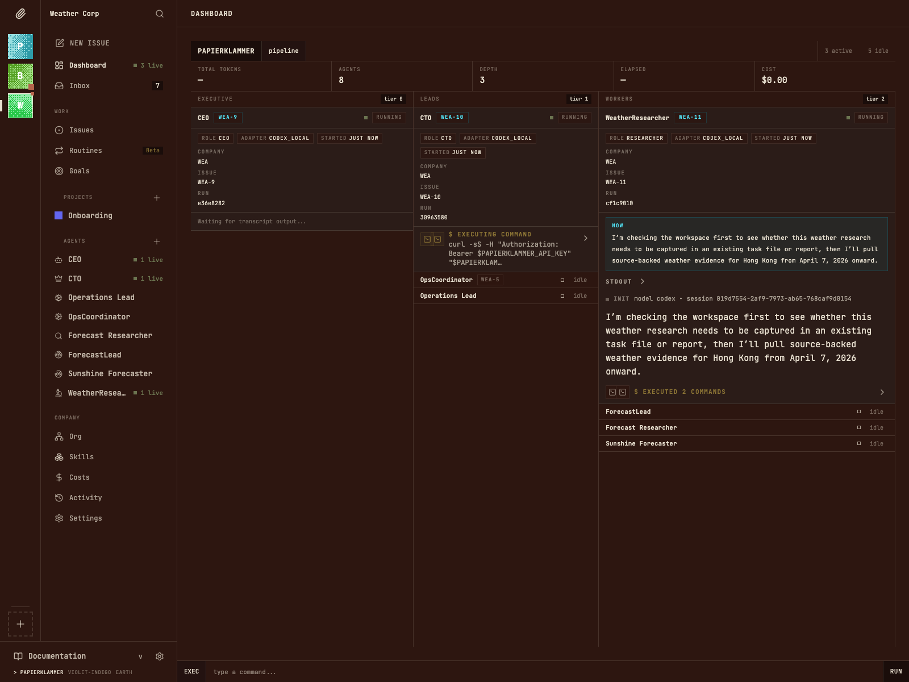

<h1 align="center">Papierklammer</h1>

<p align="center">
  An opinionated fork of <a href="https://github.com/paperclipai/paperclip">Paperclip</a>&hairsp;—&hairsp;a self-hosted control plane for running multi-agent companies.
</p>

<p align="center">
  <a href="#what-is-papierklammer">What is it?</a> &middot;
  <a href="#how-this-fork-differs-from-upstream-paperclip">Fork differences</a> &middot;
  <a href="#quickstart">Quickstart</a> &middot;
  <a href="#the-three-surfaces">Surfaces</a> &middot;
  <a href="#documentation">Docs</a>
</p>

<br />

<table align="center">
  <tr>
    <td align="center" width="33%">
      
    </td>
    <td align="center" width="33%">
      
    </td>
    <td align="center" width="33%">
      
    </td>
  </tr>
  <tr>
    <td align="center"><sub><b>PAPIERKLAMMER</b></sub></td>
    <td align="center"><sub><b>VIOLET-INDIGO</b></sub></td>
    <td align="center"><sub><b>EARTH</b></sub></td>
  </tr>
</table>

<p align="center"><sub>The reworked dashboard across all three built-in themes.</sub></p>

<br />

---

## What is Papierklammer?

Papierklammer is a self-hosted control plane that orchestrates a team of AI agents the way you would orchestrate a real company: org charts, goals, projects, issues, budgets, approvals, governance, and an audit trail. It is a Node.js server with a React board UI, a CLI, and a full-screen terminal UI (TUI).

You bring the agents (Claude Code, Codex, OpenClaw, Cursor, OpenCode, plus any HTTP/process adapter). Papierklammer decides which agent picks up which work, in which workspace, under which budget, and keeps the board state honest while it all runs.

If you have ever:

- juggled twenty terminal tabs of coding agents and lost track of who is doing what,
- watched an agent silently work in the wrong directory and quietly nuke the wrong files,
- paid a five-figure token bill because nothing capped a runaway loop,
- or wanted a task manager that runs itself instead of yet another chatbot,

...this is the kind of system Papierklammer (and its upstream, Paperclip) is built for.

> **Heads-up** -- Papierklammer is a personal fork. If you want the polished, community-supported product with Discord, plugin marketplace, telemetry, and a stable release cadence, use upstream [paperclipai/paperclip](https://github.com/paperclipai/paperclip) instead. Papierklammer is for people who specifically want the changes described below.

---

## How this fork differs from upstream Paperclip

Upstream Paperclip is strong on the product model, adapter ecosystem, and operator surface area. This fork keeps that model intact and changes three things underneath:

1. **The backend control plane** -- rebuilt around intents, leases, and execution envelopes so the orchestrator wastes less time on stale or invalid work.
2. **The UI** -- redesigned around a brutalist, monospace, TUI-inspired aesthetic. Same pages, very different look.
3. **A first-class TUI** -- a full-screen terminal client (`papierklammer-tui`) for operators who live in the terminal.

It also drops a few upstream pieces that did not fit a single-operator setup (see [What this fork removes](#what-this-fork-removes-trade-offs)).

### At a glance

| Area | Upstream Paperclip | Papierklammer |
| :--- | :--- | :--- |
| **Wakeups** | Agents are woken directly from timers, assignments, and comments. | Work first becomes a durable **intent** in `dispatch_intents`, then passes admission control. |
| **Scheduling** | Wake first, let the runtime sort it out. | Validates issue state, assignee, dependencies, workspace, budgets, leases, and agent capacity *before* dispatch. |
| **Concurrency** | Best-effort coalescing, stale-run reporting. | **Lease-controlled execution** with TTLs, renewal, expiry, and one active path per issue. |
| **Workspace binding** | Project work can drift into a fallback `agent_home` directory. | Project runs **must** resolve to a real project workspace. Missing workspace = run rejected. |
| **Run context** | Inferred at run time. | Each admitted run gets an **immutable execution envelope**. |
| **Recovery** | Stale work is surfaced, often left for manual cleanup. | Reconciler jobs, stale-lease reaping, pickup-failure tracking, and operator endpoints built in. |
| **Operator surfaces** | React board UI + CLI. | React board UI (redesigned) + CLI + **full-screen TUI** + **Orchestrator Console**. |
| **Look and feel** | Modern shadcn / Tailwind product UI. | Brutalist, monospace, terminal-inspired. No rounded corners, no shadows, one font. |
| **Telemetry** | Anonymous usage telemetry, opt-out. | **Removed.** No phone-home. |
| **Feedback / share** | Yes. | **Removed.** |
| **Routines CLI** | Yes. | Removed from CLI surface (still wired in the server). |

### What stays the same

If you already know Paperclip, the high-level model will feel familiar:

- Company-scoped agents, goals, projects, issues, approvals, and budgets
- Node.js server, React UI, CLI, and the local adapter model
- Bring-your-own runtimes -- Codex, Claude Code, OpenCode, Cursor, OpenClaw, plus process and HTTP adapters
- Self-hosted deployment with embedded PostgreSQL for local development
- The plugin SDK and the existing example plugins

The fork does **not** replace the Paperclip product model. It changes how work gets admitted, dispatched, tracked, and recovered -- and how it looks while doing it.

---

## What changed in the backend

Three ideas to remember:

- Work is queued as an **intent** before it is allowed to run.
- Active work is protected by a **lease** with expiry and renewal.
- Every admitted run gets a fixed **execution envelope** instead of inferring context on the fly.

### 1. Intent-driven dispatch

Wakes are no longer the main execution primitive. The fork adds a durable `dispatch_intents` queue. Assignments, mentions, approvals, dependency unblocks, retries, and timer hints all enter the system as **intents** first. The scheduler then decides whether that intent should actually become a run.

That means the control plane can dedupe repeated wakes for the same issue, prioritize real events over timer noise, reject invalid work before it consumes runtime, and defer work until it is actually safe and ready to run.

### 2. Lease-controlled execution

`execution_leases` enforce issue ownership in the runtime, not just in the UI. A lease is a time-limited claim on a piece of work:

- One issue gets at most one active execution lease at a time.
- Dispatched runs have a checkout TTL; activity renews the lease.
- Expired leases are reaped server-side.
- Runs that never properly pick up their work are auto-cancelled.

Instead of hoping agents behave, the control plane has an explicit ownership model and an expiry path.

### 3. Immutable execution envelopes and strict workspace binding

Every admitted run gets an `execution_envelope` row -- company, agent, issue, project, goal, workspace, wake reason, and policy version -- frozen at dispatch time.

Project work is **workspace-bound**. If a project workspace cannot be resolved, the run is rejected instead of silently falling back to a generic home directory. For anyone who has watched an agent commit work into the wrong checkout, this is the single biggest behavioral change in the fork.

### 4. Server-side reconciliation

The fork pushes recovery back into the control plane:

- Append-only `control_plane_events` for lifecycle history.
- Reconciliation jobs for orphaned runs, stale intents, and ghost `in_progress` state.
- Stale-lease reaping tied to run cleanup.
- Pickup-failure counters and escalation hooks.
- Operator endpoints for stale inspection, cleanup, nudges, and force-unblock.

The result: a board that converges toward runtime truth faster, with less operator babysitting.

### 5. Dependency-aware scheduling

Issue dependencies are tracked in the backend and unresolved dependencies are an admission gate. When a dependency completes, the control plane enqueues `dependency_unblocked` intents automatically -- runtime stops poking blocked issues and starts spending on work that just became actionable.

### 6. Warm workspace reuse

A warm workspace pool keeps healthy workspace state in circulation -- reuse healthy checkouts when possible, avoid unnecessary cold starts, keep the right checkout sticky for repeated work on the same project, and keep actively leased workspaces out of the pool.

### 7. Stronger terminal-state enforcement

A run that checks out work but finishes silently can be treated as a policy violation instead of being counted as success. The server has explicit logic for checkout deadlines, lease renewal as keepalive, silent-completion detection, and automatic escalation when a run repeatedly fails to pick up or advance work.

<details>
<summary><strong>Backend components added by the fork</strong></summary>

<br />

If you have worked on upstream Paperclip before, these are the pieces to inspect first:

**New tables** -- `dispatch_intents`, `execution_leases`, `execution_envelopes`, `control_plane_events`, `issue_dependencies`

**New services** -- `scheduler`, `dispatcher`, `lease-manager`, `reconciler`, `intent-queue`, `timer-intent-bridge`, `warm-workspace-pool`, `terminal-state-policy`, `escalation`, `dependency`, `event-log`, `projections`

**New routes** -- `orchestrator` recovery API and operator tooling (`server/src/routes/orchestrator.ts`)

</details>

### Why this is faster in practice

- Timer hints no longer compete equally with meaningful events.
- Duplicate work is blocked before it becomes a second run.
- Stale ownership expires instead of sitting indefinitely.
- Blocked issues stop consuming scheduler attention.
- Warm workspaces reduce repeat setup cost.
- Board state is repaired automatically instead of waiting on manual cleanup.

The aim is not to make agents think faster. The aim is to stop the orchestrator from slowing them down.

---

## The three surfaces

Papierklammer exposes the same control plane through three operator surfaces.

### 1. The Board (Web UI)

A React board with companies, org charts, goals, projects, issues, approvals, budgets, costs, plugins, and instance settings. Same product model as upstream, **redesigned from scratch** -- TUI-inspired, brutalist, monospace-only. No border-radius, no shadows, no gradients. Borders are the only spatial dividers. Three swappable themes (rose, earth, violet-indigo).

If you liked the modern shadcn look upstream uses, you will probably *not* like this. If you want a board that feels like a terminal pretending to be a web app, this is the point. See `papierklammer-design-system.md` for the design contract.

### 2. The CLI

Same operator commands as upstream Paperclip, plus the orchestrator routes:

```bash
pnpm papierklammer onboard --yes      # one-shot setup
pnpm papierklammer run                # run the local server
pnpm papierklammer doctor             # diagnose a local install
pnpm papierklammer issue ...          # inspect/manage issues
pnpm papierklammer agent ...          # inspect/manage agents
pnpm papierklammer dashboard          # quick dashboard summary
pnpm papierklammer --help             # full command list
```

### 3. The Orchestrator TUI

A full-screen terminal UI built on **Ink + React** (`packages/orchestrator-tui`). Not a thin CLI wrapper -- it is a real client to the same control plane the board UI talks to.

```bash
pnpm dev:tui          # run the TUI against your local Papierklammer
# or, after a build:
papierklammer-tui --url http://localhost:3100 --api-key <key>
```

What you get inside the TUI:

- Chat panel against a top-level management agent
- Live agent sidebar and status bar
- Company picker, settings overlay, and help overlay
- Streaming command blocks for agent tool calls
- Error boundary so a bad message does not eat your terminal

There is also an embedded **Orchestrator Console** package (`packages/orchestrator-console`) used by the board to host the same chat surface as a board widget -- see `orchestrator-console.md` for the spec.

---

## What this fork removes (trade-offs)

Be honest with yourself before adopting it. This fork is not strictly "better" -- it is **different**, and a few upstream things are gone:

| Removed | Detail |
| :--- | :--- |
| **Telemetry** | Upstream ships anonymous, opt-out telemetry. Papierklammer removes it entirely. |
| **Feedback / share flow** | Upstream has a "send feedback" path with redaction; the fork drops it. |
| **`routines` CLI command** | The routines feature still exists on the server side, but the dedicated CLI surface was removed. |
| **Public docs site** | Upstream has a Mintlify docs site; this fork only ships the in-repo `doc/` and `docs/` folders. |
| **Community** | No Discord, no plugin marketplace. This is a personal fork, not a product. |

Other things to know:

- **Diverges from upstream.** The control-plane changes are deep enough that pulling in upstream changes is non-trivial. If you care about staying close to mainline Paperclip, do not use this fork.
- **Higher backend complexity.** Intents, leases, envelopes, reconcilers, projections, and a warm workspace pool are real surface area. More moving parts than upstream.
- **The new UI is a strong opinion.** Brutalist, monospace, no rounded corners. Acquired taste.
- **Renamed everywhere.** Package names, env vars, and config directories are `papierklammer*`, not `paperclip*`. State lives under `~/.papierklammer` by default. Existing Paperclip data does not migrate automatically.

If those trade-offs sound bad, use upstream [paperclipai/paperclip](https://github.com/paperclipai/paperclip) instead. It is the right project for most people.

---

## Quickstart

**Requirements:** Node.js 20+ and pnpm 9.15+.

```bash
git clone <this-fork>
cd papierklammer_droid
pnpm install
pnpm dev
```

This boots the API server at `http://localhost:3100`, an embedded PostgreSQL (no setup required), the React board UI in dev mode, and the TUI alongside it. Use `pnpm dev:server` if you want the server alone.

```bash
# health check
curl http://localhost:3100/api/health
curl http://localhost:3100/api/companies
```

### Onboarding via the CLI

```bash
pnpm papierklammer onboard --yes
pnpm papierklammer run
```

Local state lives under `~/.papierklammer` by default.

### Run only the TUI against an existing instance

```bash
pnpm dev:tui
# or after building:
node packages/orchestrator-tui/dist/index.js \
  --url http://localhost:3100 \
  --api-key "$PAPIERKLAMMER_API_KEY"
```

---

## Development

Common commands from the repository root:

```bash
pnpm dev              # full dev (server + UI + TUI)
pnpm dev:watch        # server in watch mode
pnpm dev:tui          # TUI only
pnpm dev:server       # server only
pnpm dev:once         # full dev without file watching
pnpm typecheck        # type check the workspace
pnpm test:run         # run unit tests
pnpm build            # build everything
pnpm db:generate      # generate a Drizzle migration
pnpm db:migrate       # apply migrations
pnpm papierklammer --help
```

---

## Documentation

| Document | Description |
| :--- | :--- |
| [`PAPERCLIP_FORK_SPEC.md`](PAPERCLIP_FORK_SPEC.md) | Full control-plane spec (intents, leases, envelopes, reconciler) |
| [`PAPERCLIP_ARCHITECTURE_REPORT.md`](PAPERCLIP_ARCHITECTURE_REPORT.md) | Architecture report against upstream Paperclip |
| [`papierklammer-design-system.md`](papierklammer-design-system.md) | The brutalist UI design contract |
| [`orchestrator-console.md`](orchestrator-console.md) | Spec for the embedded Commander chat surface |
| [`doc/SPEC-implementation.md`](doc/SPEC-implementation.md) | Implementation spec |
| [`doc/DEVELOPING.md`](doc/DEVELOPING.md) | Development guide |
| [`docs/start/architecture.md`](docs/start/architecture.md) | Architecture overview |
| [`docs/agents-runtime.md`](docs/agents-runtime.md) | Agent runtime guide |

---

## Contributing

Contributions are welcome. Please read [CONTRIBUTING.md](CONTRIBUTING.md) before opening a pull request.

This is a personal fork, so the bar for accepting changes is "does it fit the control-plane and design opinions described above?" -- not strict feature parity with upstream.

---

## License and attribution

MIT. Papierklammer builds directly on [paperclipai/paperclip](https://github.com/paperclipai/paperclip). Credit for the original product model, baseline architecture, plugin SDK, adapter ecosystem, and open-source foundation belongs with the upstream project.

If Papierklammer is useful to you, the right way to thank somebody for it is to go star upstream Paperclip first.
